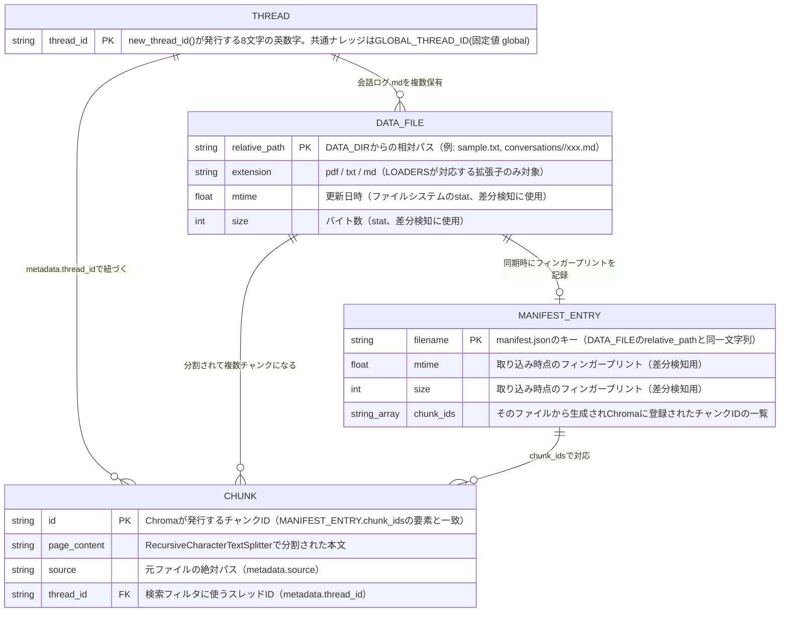

# データ構造（ER図）

## 背景

本プロジェクトはRDB（リレーショナルデータベース）を使っておらず、Chromaベクトルストア＋
ローカルファイル（`data/`配下）でデータを管理しているため、厳密な意味での「テーブル」は存在しない。
しかし「何がどんな役割を持ち、どう繋がっているか」を直感的に把握したいというニーズに応えるため、
実装（`ingest.py` / `rag_chain.py` / `memory.py`）を根拠に、アプリケーションから見たデータ構造を
[Mermaid](https://mermaid.js.org/) の `erDiagram` 記法でER図として可視化する。

対象はあくまでアプリケーションから見たデータ構造であり、Chromaの内部実装（SQLite等）そのものは
対象外とする。

## ER図

## 各エンティティの役割

- **THREAD（会話スレッド）**: `memory.py`の`new_thread_id()`が発行する8文字のランダムな英数字ID。
  ユーザーが「新しい会話を始める」操作をするたびに新しいスレッドが作られる。共通ナレッジ
  （`data/`直下のファイルやアップロードファイルなど、全スレッドから検索してよいもの）には、
  実在のスレッドではなく`rag_chain.py`が定義する`GLOBAL_THREAD_ID`（固定値`"global"`）が
  割り当てられる。
- **DATA_FILE（`data/`配下の物理ファイル）**: `data/`直下に置かれた質問対象ファイル（PDF/txt/md）や、
  `data/conversations/<thread_id>/`配下に保存される会話ログ（.md）を表す。`ingest.py`の
  `_thread_id_for()`が相対パスからそのファイルがどのスレッドに属するか（会話ログなら該当スレッド、
  それ以外は`global`）を判定する。
- **MANIFEST_ENTRY（`chroma_db/manifest.json`）**: `ingest.py`の`_load_manifest()`/`_save_manifest()`
  が管理する、ファイル名をキーにした差分同期用の台帳。ファイルの更新日時・サイズ（フィンガープリント）
  と、そのファイルから生成したチャンクID一覧（`chunk_ids`）を保持する。次回同期時にフィンガープリントが
  変わっていなければ再取り込みをスキップし、変わっていれば古いチャンクを`chunk_ids`をもとに削除してから
  再登録する。同期に失敗したファイルはエントリが作られない（＝次回同期時に自動的にリトライされる）ため、
  DATA_FILEに対して0件または1件（`||--o|`）の関係になる。
- **CHUNK（Chromaのドキュメントチャンク）**: `rag_chain.py`の`get_vectorstore()`が管理するChroma
  コレクション内の実データ。1つのDATA_FILEは`RecursiveCharacterTextSplitter`によって複数のチャンクに
  分割され、それぞれが`page_content`（本文）と`metadata`（`source`＝元ファイルの絶対パス、
  `thread_id`＝検索フィルタに使うスレッドID）を持つ。`rag_chain.build_agent(thread_id)`は検索時に
  `metadata.thread_id`が「そのスレッド自身」または`"global"`であるチャンクのみに絞り込むことで、
  無関係な別スレッドの会話ログが回答に混ざらないようにしている。

## なぜこの構造になっているか

- RDBを導入せず、ローカル完結・無料で動くChroma＋ファイルシステムだけで構成しているのは、本プロジェクトが
  「無料で完結するローカルRAG」を方針としているため（[AGENTS.md](../AGENTS.md)参照）。RDBサーバーを
  別途立てるコストをかけずに済む。
- MANIFEST_ENTRYという独自の台帳を持っているのは、Chroma自体には「元ファイルが変更されたかどうか」を
  高速に判定する仕組みがないため。ファイルの中身を毎回読み込んで再埋め込みするのは無駄が大きいので、
  軽量なstat情報（更新日時・サイズ）だけで差分検知できるようにしている。
- CHUNKとTHREADの関係が「直接の外部キー」ではなくChromaのメタデータフィルタ（`metadata.thread_id`）で
  表現されているのは、Chromaがドキュメント指向のベクトルストアであり、RDBのような正規化されたリレーションを
  持たないため。その代わりに、検索時のフィルタ条件としてスレッドの分離を実現している。

## 図の確認方法

この図はMermaidの`erDiagram`記法で記述しており、GitHub上のMarkdownプレビュー（PRやリポジトリの
ファイル表示画面）で自動的にレンダリングされる。手元で構文を確認したい場合は
[Mermaid Live Editor](https://mermaid.live/) にこの図のコードブロックの中身を貼り付けることでも
確認できる（いずれも無料）。
